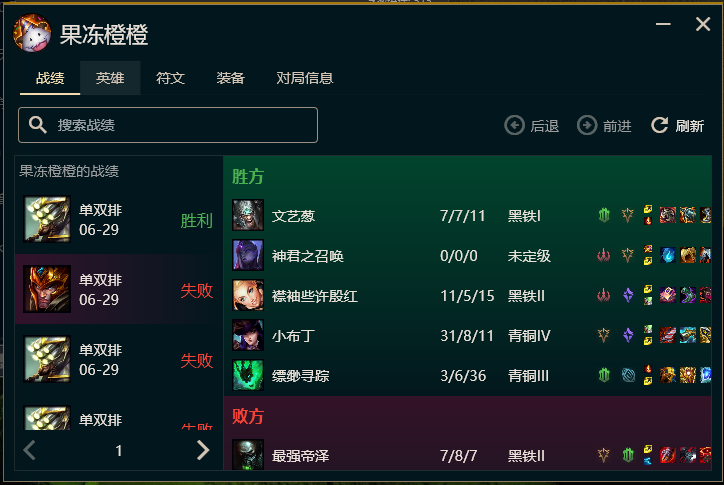
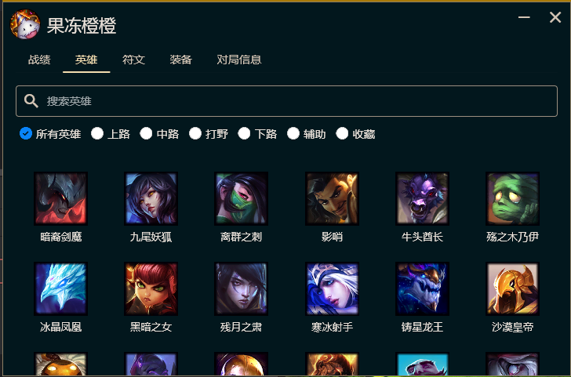
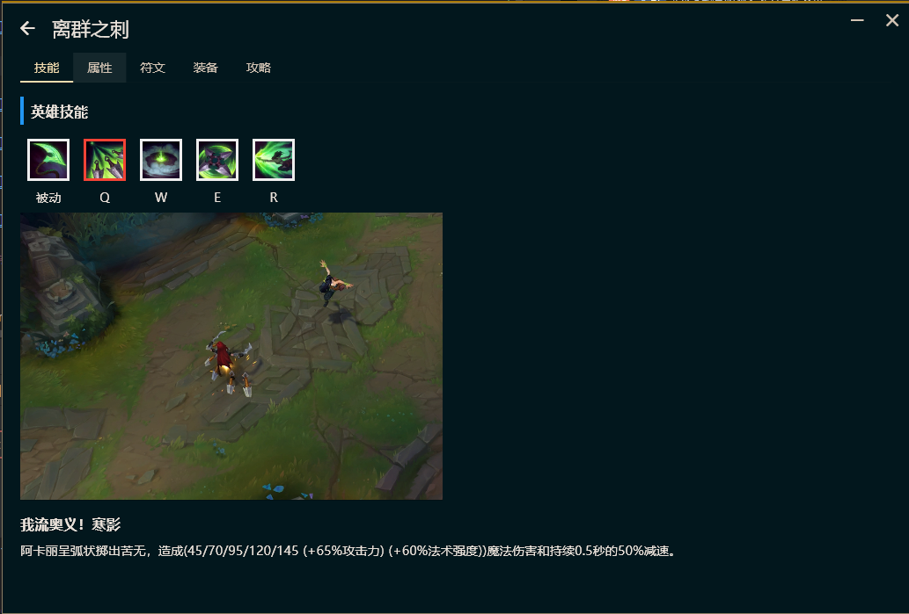
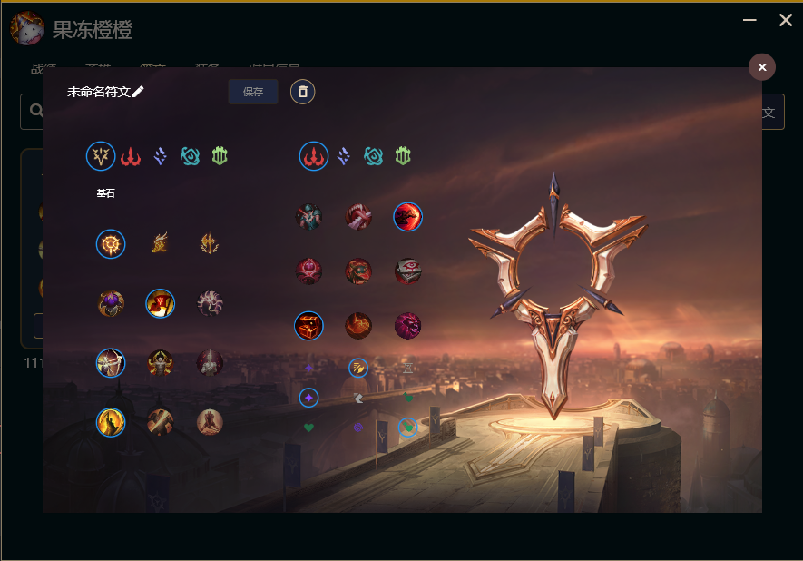
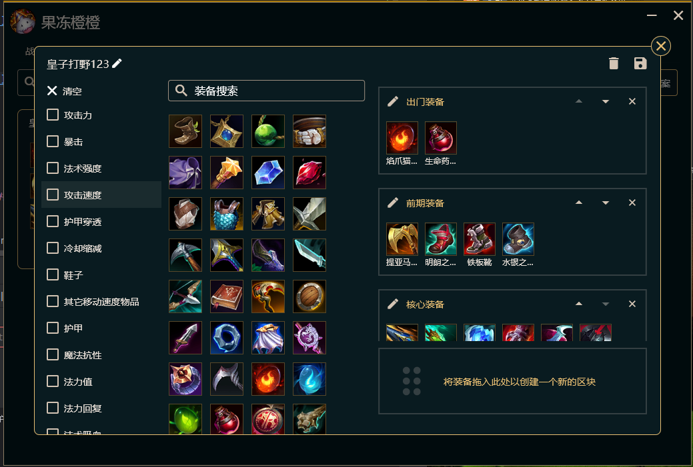
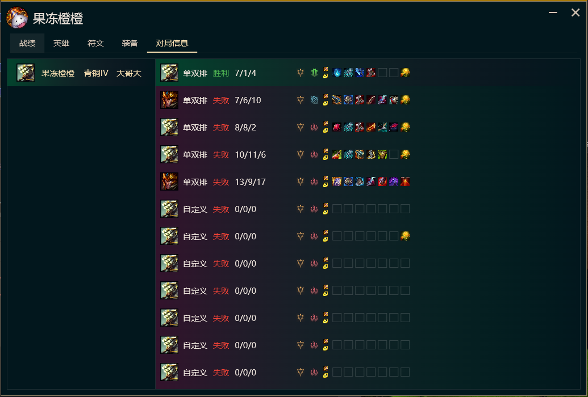
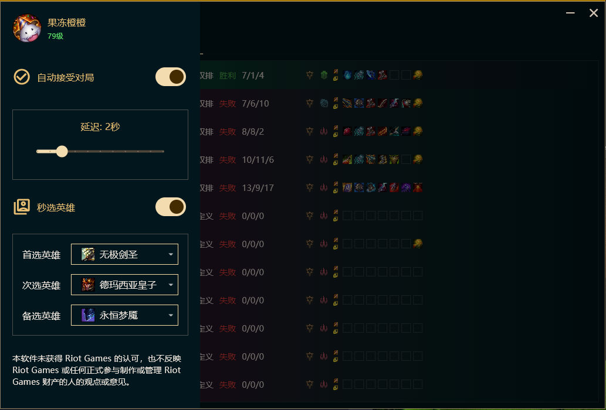
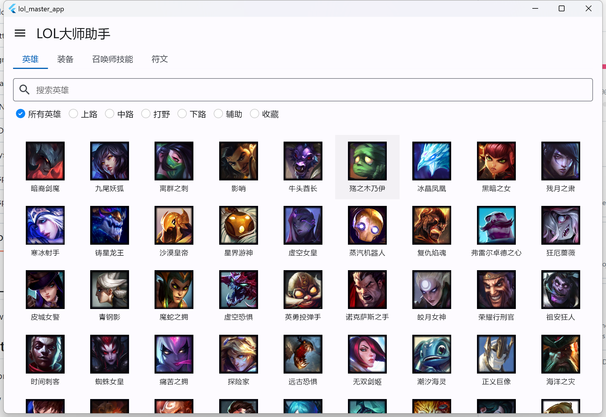

# LOL大师助手
## 项目介绍
一个学习 flutter 开发的小工具，目标是帮助玩家练习打LOL,成为英雄联盟大师的同时，学会 Flutter 编程技术。
## 软件截图
### 战绩查询

### 英雄列表

### 英雄详情

### 符文配置

### 装备配置

### 大哥分析

### 游戏设置

### 最初始的样子

## 路线图

- (一)项目介绍，开发目标(简单)
-  (二)搭建 Flutter 开发环境，创建 Flutter 工程(简单)
- (三)使用 MVC 开发一个界面(简单)
- (四)设计 UI 界面草图(普通)
- (五)开发各个界面，完成基本功能(普通)
- (六)设计 sqlite 数据库、录入数据(普通)
- (七)搭建 Java 开发环境，创建 SpringBoot 工程(简单)
- (八)用虚拟机创建 Redis 服务和 MySQL 服务(普通)
- (九)SpringBoot 整合 Redis 和 MySQL，使用 MyBatis 读写数据库(普通)
- (十)设计数据库、录入数据(普通)
- (十一)开发用户数据同步接口(困难)
- (十二)优化APP界面(困难)